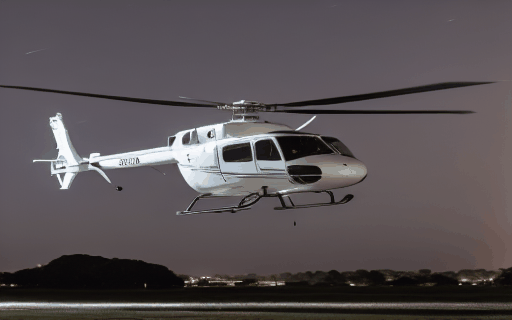
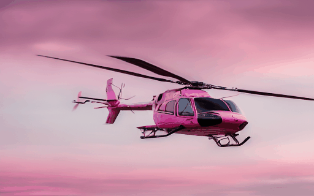

# <p align="center"> HuViDPO: Enhancing Video Generation through Direct Preference Optimization for Human-Centric Alignment </p>


 

[[Arxiv Paper](#待更新)]&nbsp;
[[Website Page](#待更新)]&nbsp;
[[Google Drive](https://drive.google.com/drive/folders/1hIIcpn4WGoM9wVcfbiZTD2fgCzPk7A_X?usp=drive_link)]&nbsp;
[[Baidu Disk (pwd: ffsp)](#待更新)]&nbsp;
[[Colab Notebook](#待更新)]&nbsp;

<!--
[[Arxiv Paper](https://arxiv.org/abs/2310.10769)]&nbsp;
[[Website Page](https://rq-wu.github.io/projects/LAMP/index.html)]&nbsp;
[[Google Drive](https://drive.google.com/drive/folders/1hIIcpn4WGoM9wVcfbiZTD2fgCzPk7A_X?usp=drive_link)&nbsp;
[[Baidu Disk (pwd: ffsp)](https://pan.baidu.com/s/1y9L2kfUlaHVZGE6B0-vXnA)]&nbsp;
[[Colab Notebook](https://colab.research.google.com/drive/1Cw2e0VFktVjWC5zIKzv2r7D2-4NtH8xm?usp=sharing)]&nbsp;
-->

<!--
&nbsp;

:rocket: LAMP is a **few-shot-based** method for text-to-video generation. You only need **8~16 videos 1 GPU (> 15 GB VRAM)** for training!! Then you can generate videos with learned motion pattern.
-->

## News
<!--
- [2024/02/27] Our paper is accepted by CVPR2024!
- [2023/11/15] The code for applying LAMP on video editing is released!
- [2023/11/02] The [Colab demo](https://colab.research.google.com/drive/1Cw2e0VFktVjWC5zIKzv2r7D2-4NtH8xm?usp=sharing) is released! Thanks for the PR of @ShashwatNigam99.
-->
- [2023/11/13] We add Google Drive link about our checkpoints and training data.
- [2024/11/12] We release our checkpoints.
- [2024/11/11] Our code is publicly available.
## Preparation
### Dependencies and Installation
- Ubuntu > 18.04
- CUDA=11.3
- Others:

```bash
# clone the repo
git clone https://github.com/Tankowa/HuViDPO.git
cd HuViDPO

# create virtual environment
conda create -n HuViDPO python=3.8
conda activate HuViDPO

# install packages
conda install pytorch==1.12.1 torchvision==0.13.1 torchaudio==0.12.1 cudatoolkit=11.6 -c pytorch -c conda-forge
pip install -r requirements.txt
pip install xformers==0.0.13
```

### Weights and Data
1. You can download pre-trained T2I diffusion models on Hugging Face.
In our work, we use [Stable Diffusion v1.4](https://huggingface.co/CompVis/stable-diffusion-v1-4) as our backbone network. Clone the pretrained weights by `git-lfs` and put them in `./checkpoints`

2. Our checkpoint and training data are listed as follows. You can also collect video data by your own (Suggest websites: [pexels](https://pexels.com/), [frozen-in-time](https://meru.robots.ox.ac.uk/frozen-in-time/)) and put .mp4 files in `./train_data/videos/[motion_name]/` and `./train_data/dpo_videos/[motion_name]/`

3. [Update] You can find the training videos and our trained model weights at [[Google Drive](https://drive.google.com/drive/folders/1e409tML98gwouIOxFwcFuGVBSNwsfEtY?usp=share_link)]

<!--
<table class="center">
<tr>
    <td align="center"> Motion Name </td>
    <td align="center"> Checkpoint Link </td>
    <td align="center"> Training data </td>
</tr>
<tr>
    <td align="center">Birds fly</td>
    <td align="center"><a href="https://pan.baidu.com/s/1nuZVRj-xRqkHySQQ3jCFkw">Baidu Disk (pwd: jj0o)</a></td>
    <td align="center"><a href="https://pan.baidu.com/s/10fi8KoBrGJMpLQKhUIaFSQ">Baidu Disk (pwd: w96b)</a></td>
</tr>
<tr>
    <td align="center">Firework</td>
    <td align="center"><a href="https://pan.baidu.com/s/1zJnn5bZpGzChRHJdO9x6WA">Baidu Disk (pwd: wj1p)</a></td>
    <td align="center"><a href="https://pan.baidu.com/s/1uIyw0Q70svWNM5z7DFYkiQ">Baidu Disk (pwd: oamp)</a></td>
</tr>
<tr>
    <td align="center">Helicopter</td>
    <td align="center"><a href="https://pan.baidu.com/s/1oj6t_VFo9cX0vTZWDq8q3w">Baidu Disk (pwd: egpe)</a></td>
    <td align="center"><a href="https://pan.baidu.com/s/1MYMjIFyFTiLGEX1w0ees2Q">Baidu Disk (pwd: t4ba)</a></td>
</tr>
<tr>
    <td align="center">Horse run</td>
    <td align="center"><a href="https://pan.baidu.com/s/1lkAFZuEnot4JGruLe6pR3g">Baidu Disk (pwd: 19ld)</a></td>
    <td align="center"><a href="https://pan.baidu.com/s/1z7FHN-aotdOF2MPUk4lDJg">Baidu Disk (pwd: mte7)</a></td>
</tr>
<tr>
    <td align="center">Play the guitar</td>
    <td align="center"><a href="https://pan.baidu.com/s/1uY47E08_cUofmlmKWfi46A">Baidu Disk (pwd: l4dw)</a></td>
    <td align="center"><a href="https://pan.baidu.com/s/1cemrtzJtS_Lm8y8nZM9kSw">Baidu Disk (pwd: js26)</a></td>
</tr>
<tr>
    <td align="center">Rain</td>
    <td align="center"><a href="https://pan.baidu.com/s/1Cvsyg7Ld2O0DEK_U__2aXg">Baidu Disk (pwd: jomu)</a></td>
    <td align="center"><a href="https://pan.baidu.com/s/1hMGrHCLNRDLJQ-4XKk6hZg">Baidu Disk (pwd: 31ug)</a></td>
</tr>
<tr>
    <td align="center">Turn to smile</td>
    <td align="center"><a href="https://pan.baidu.com/s/1UYjWncrxYiAhwpNAafH5WA">Baidu Disk (pwd: 2bkl)</a></td>
    <td align="center"><a href="https://pan.baidu.com/s/1ErFSm6t-CtYBzsuzxi08dg">Baidu Disk (pwd: l984)</a></td>
</tr>
<tr>
    <td align="center">Waterfall</td>
    <td align="center"><a href="https://pan.baidu.com/s/1tWArxOw6CMceaW_49rIoSA">Baidu Disk (pwd: vpkk)</a></td>
    <td align="center"><a href="https://pan.baidu.com/s/1hjlqRwa35nZ2pc2D-gIX9A">Baidu Disk (pwd: 2edp)</a></td>
</tr>
<tr>
    <td align="center">All</td>
    <td align="center"><a href="https://pan.baidu.com/s/1vRG7kMCTC7b9YUd4qsSP_A">Baidu Disk (pwd: ifsm)</a></td>
    <td align="center"><a href="https://pan.baidu.com/s/1h5HrIGWP5OlMqp9gkD9cyQ">Baidu Disk (pwd: 2i2k)</a></td>
</tr>
</table>
-->

## Get Started
### 1. Training
```bash
# Fine-tune base model, you can find train videos at ./train_data/videos/[motion_name]/
CUDA_VISIBLE_DEVICES=X python train_lamp.py --config configs/smile.yaml

# Fine-tune using DPO strategy, you can find train videos at ./train_data/dpo_videos/[motion_name]/
CUDA_VISIBLE_DEVICES=X python new_train.py --config configs/smile-dpo.yaml --weights ./output/smile/diffusion_pytorch_model.bin
```

### 2. Inference
Here is an example command for inference
```bash
# Motion Pattern
CUDA_VISIBLE_DEVICES=X python inference_script_dpo.py --weight ./output/smile/diffusion_pytorch_model.bin --pretrain_weight ./checkpoints/CompVis/stable-diffusion-v1-4 --image_path ./val_data/smile --prompt_path ./val_data/smile/smile.txt --output_path ./output/smile_lora --lora_weights ./output/smile/model_weights_epoch_1.pth

#########################################################################################################
# --weight:           the path of our model(Fine-tune base model)
# --lora_weights:      the path of our model(Fine-tune using DPO strategy)    
# --pretrain_weight:  the path of the pre-trained model (e.g. SDv1.4)
# --first_frame_path: the path of the first frame generated by T2I model (e.g. DPO-XL)
# --prompt:           the input prompt, the default value is aligned with the filename of the first frame
# --output:           output path, default: ./results 
# --height:           video height, default: 320
# --width:            video width, default: 512
# --length            video length, default: 16
# --cfg:              classifier-free guidance, default: 12.5
#########################################################################################################
```


## Visual Examples
### Few-Shot-Based Text-to-Video Generation
<table class="center">
    <tr>
        <td align="center" style="width: 7%"> Firework</td>
        <td align="center">
            
        </td>
        <td align="center">
            
        </td>
        <td align="center">
            
        </td>
    </tr>
    <tr>
        <td align="center" style="width: 7%"> Helicopter</td>
        <td align="center">
            
        </td>
        <td align="center">
            
        </td>
        <td align="center">
            
        </td>
    </tr>
    <tr>
        <td align="center" style="width: 7%"> Waterfall</td>
        <td align="center">
            
        </td>
        <td align="center">
            
        </td>
        <td align="center">
            
        </td>
    </tr
    <tr>
        <td align="center" style="width: 7%"> Play the guitar</td>
        <td align="center">
            
        </td>
        <td align="center">
            
        </td>
        <td align="center">
            
        </td>
    </tr>
    <tr>
        <td align="center" style="width: 7%"> Birds fly</td>
        <td align="center">
            
        </td>
        <td align="center">
            
        </td>
        <td align="center">
            
        </td>
    </tr>
<table>


## Citation
If you find our repo useful for your research, please cite us:
```
Coming soon！
```

## License
Licensed under a [Creative Commons Attribution-NonCommercial 4.0 International](https://creativecommons.org/licenses/by-nc/4.0/) for Non-commercial use only.
Any commercial use should get formal permission first.

## Acknowledgement
This repository is maintained by [Lifan Jiang](https://rq-wu.github.io/).
The code is built based on [LAMP](https://github.com/RQ-Wu/LAMP). Thanks for the excellent open-source code!!
